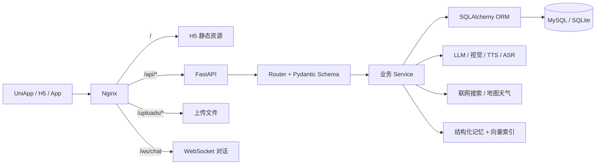

# 日迹（Avalin）后端

日迹是一款面向大学生的 AI 生活伙伴应用。本仓库提供认证、素材、日记、AI 对话、记忆、校园广场、AI 分身、社交、学习与小传等后端能力。

[前端仓库](https://github.com/Qyjay/riji-frontend) · [接口文档](docs/API-DOCS.md) · [开发入门](docs/ONBOARDING.md)


## 当前规模

- 134 个 HTTP 路由、1 个 WebSocket 路由
- 17 个业务模块、33 个数据模型
- 17 个 Alembic 迁移、25 个测试文件
- 开发环境支持 SQLite，生产编排使用 MySQL 8.4
- 支持 MiniMax、vivo、火山方舟、Exa、火山联网搜索、高德地图等外部能力

## 架构



后端采用模块化单体架构。每个业务模块通常由 `router.py`、`schemas.py` 和 `service.py` 组成：

| 层 | 主要职责 |
|---|---|
| `app/main.py` | 应用生命周期、中间件、异常处理、静态目录和路由注册 |
| `router.py` | HTTP/WebSocket 边界、认证依赖、参数与响应编排 |
| `schemas.py` | Pydantic 请求与响应契约 |
| `service.py` | 业务规则、跨模型编排和外部服务调用 |
| `app/models/` | SQLAlchemy 数据模型 |
| `app/database.py` | 同步数据库引擎、会话和 SQLite 兼容配置 |
| `app/response.py` | 统一响应体与业务错误码 |
| `alembic/` | 数据库版本迁移 |

### 业务模块

| 模块 | 路径前缀 | 能力 |
|---|---|---|
| 认证 | `/api/auth` | 注册、登录、登出、健康检查 |
| 用户 | `/api/user` | 资料、设置、成长、画像、学期报告 |
| 素材与上传 | `/api/materials`、`/api/upload` | 文字、图片、语音、文件与 AI 处理 |
| 日记与衍生 | `/api/diaries`、`/api/derivatives` | 日记生成、点评、情绪、漫画/小说等衍生内容 |
| AI 与对话 | `/api/ai`、`/api/chat`、`/ws/chat` | 模型管理、TTS/ASR、对话、SSE 与 WebSocket |
| 记忆系统 | `/api/memory` | 文档、事实、检索、画像、权限和维护 |
| 广场与分身 | `/api/plaza`、`/api/avatar` | 帖子、评论、分身冲浪、A2A 匹配和行动审批 |
| 社交 | `/api/social` | 匹配、搭子、消息与匹配报告 |
| 学习与纪念日 | `/api/study`、`/api/anniversaries` | 番茄钟、待办、纪念日和那年今日 |
| 位置与小传 | `/api/location`、`/api/biography` | 地址天气、自传目录与章节生成 |

## 本地开发

### 环境要求

- Python 3.11
- Git
- 可选：MySQL 8.x、Docker 及 Docker Compose
- AI、搜索和地图功能所需的服务端密钥

### 启动

```bash
git clone https://github.com/Qyjay/riji-backend.git
cd riji-backend

python3.11 -m venv .venv
source .venv/bin/activate
pip install -r requirements.txt

cp .env.example .env
# 至少修改 JWT_SECRET；按需填写 AI、搜索和地图配置

alembic upgrade head
python scripts/seed.py          # 可选：仅用于本地开发数据

uvicorn app.main:app --reload --host 127.0.0.1 --port 8000
```

启动后可访问：

- API 根地址：`http://127.0.0.1:8000`
- Swagger：`http://127.0.0.1:8000/docs`
- OpenAPI：`http://127.0.0.1:8000/openapi.json`
- 健康检查：`http://127.0.0.1:8000/api/auth/health`

开发种子账号及扩展种子脚本见 [开发入门](docs/ONBOARDING.md)。不要在生产环境执行种子脚本或使用示例密码。

## 配置

配置由 `app/config.py` 通过 `.env` 加载。常用配置分组如下：

| 分组 | 关键变量 |
|---|---|
| 数据库 | `DATABASE_URL` |
| 认证 | `JWT_SECRET`、`JWT_EXPIRE_DAYS` |
| AI 提供商 | `LLM_PROVIDER`、`MINIMAX_*`、`VIVO_*`、`ARK_*` |
| 搜索 | `WEB_SEARCH_PROVIDER`、`EXA_*`、`VOLC_SEARCH_*` |
| 记忆 | `MEMORY_*`、`DASHSCOPE_*` |
| 地图天气 | `AMAP_*` |
| 上传与服务 | `UPLOAD_DIR`、`MAX_FILE_SIZE`、`HOST`、`PORT` |

仓库仅跟踪 `.env.example` 和 `.env.production.example`。真实密钥必须保存在未跟踪的 `.env` / `.env.production` 或专用密钥管理系统中。

### 统一响应与认证

大多数 HTTP 接口返回：

```json
{
  "code": 0,
  "data": {},
  "message": "ok"
}
```

受保护接口使用 JWT：

```http
Authorization: Bearer <token>
```

个别历史接口为保持前端兼容会直接返回数组；以 Swagger、`docs/API-DOCS.md` 和实际路由实现为准。

## 测试与迁移

```bash
# 测试
python -m pytest tests -v

# 生成迁移
alembic revision --autogenerate -m "describe change"

# 应用迁移
alembic upgrade head
```

模型变更必须附带 Alembic 迁移。生产容器启动时会先执行 `alembic upgrade head`。

## 生产部署

当前服务器地址：`115.190.218.167`。仓库内的生产拓扑由 `docker-compose.yml` 定义：

```text
Internet -> Nginx :80 -> H5 静态文件
                    ├-> /api/*     -> FastAPI :8000
                    ├-> /uploads/* -> FastAPI :8000
                    └-> /ws/*      -> FastAPI :8000
FastAPI -> MySQL :3306（仅绑定 127.0.0.1）
```

部署前：

1. 将前端 H5 构建产物放入 `deploy/frontend/`。
2. 从 `.env.production.example` 创建 `.env.production`，替换数据库密码、JWT 密钥和外部服务密钥。
3. 确认 `DATABASE_URL` 使用 Compose 中的 MySQL 服务名。
4. 启动服务并检查迁移与健康状态。

```bash
docker compose up -d --build
docker compose ps
docker compose logs --tail=200 backend
curl http://115.190.218.167/api/auth/health
```

仓库中的 Nginx 配置只监听 80 端口；HTTPS 证书与 443 终止需要由服务器外层代理、负载均衡或额外 Nginx 配置负责。当前配置也不会把 `/docs` 和 `/openapi.json` 代理到后端，生产环境应通过内网访问文档，或显式增加受保护的代理规则。

## 目录结构

```text
riji-backend/
├── app/
│   ├── main.py
│   ├── config.py
│   ├── database.py
│   ├── dependencies.py
│   ├── response.py
│   ├── models/
│   ├── auth/ ai/ chat/ diary/ material/
│   ├── memory/ plaza/ avatar/ social/
│   └── study/ anniversary/ location/ biography/
├── alembic/
├── tests/
├── scripts/
├── docs/
├── deploy/nginx/default.conf
├── Dockerfile
├── docker-compose.yml
├── requirements.txt
└── requirements.prod.txt
```

## 架构边界

- 数据库访问使用同步 SQLAlchemy；长耗时 AI 调用应保持异步，避免阻塞请求线程。
- 自动日记任务运行在 API 进程生命周期内，生产配置固定为单 worker。若扩展为多副本，应迁移到独立任务队列或调度器，避免重复执行。
- `app/main.py` 当前允许任意 CORS 来源。正式公网环境应收紧到可信前端域名。
- SQLite 适合本地开发；多用户生产环境使用 MySQL，并以 Alembic 作为唯一迁移依据。
- 上传文件和本地向量目录通过 Docker volume 持久化；扩容到多实例前需要迁移到共享对象存储与共享向量服务。

## License

本仓库暂未声明独立许可证。若计划公开分发或接受外部贡献，请先补充明确的 License。
